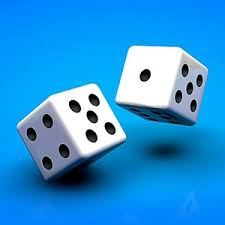

# What is Markdown?

`Markdown is a lightweight markup language that you can use to add formatting elements to plaintext text documents. Created by John Gruber in 2004, Markdown is now one of the world’s most popular markup languages.`

`Using Markdown is different than using a WYSIWYG editor. In an application like Microsoft Word, you click buttons to format words and phrases, and the changes are visible immediately. Markdown isn’t like that. When you create a Markdown-formatted file, you add Markdown syntax to the text to indicate which words and phrases should look different.`

<!-- Headings -->
# Heading 1
## Heading 2 
### Heading 3
###### Heading 6 

<!-- Italics -->
*This text* is italic
_This Text_ is also italic

<!-- Strong -->
**This text** is strong
__This text__ is also strong

<!-- Strikethrough -->
~~This text~~ is strikethrough 

<!-- Horizontal Ruler -->
---
Horizontal Ruler using --- or ___
___

<!-- Blockquote -->
> This is a quote 

<!-- Links -->
[Traversy Media](http://www.traversymedia.com)
[Youtube](http://www.youtube.com)

<!-- UL -->
* Item 1
* Item 2
* Item 3
  * Nested Item 1
  * Nested Item 2
* Item 4
  
<!-- OL -->
1. Item 1
2. Item 2
3. Item 3

    <!-- Inline Code block -->
`This is a paragraph`

<!-- Images -->
>Using markdown



>Using html


<!-- Github Markdown -->

<!-- Code Blocks -->
```bash
npm install
npm start
```

```js
//add function for javascript
function add(num1,num2){
    return num1+num2;
}
```
```python
#Add function for python
def add(num1,num2):
    return num1+num2
```
```css
.side-navbar.shrink ul li a[data-toggle="collapse"]::before {
  content: '\f107';
  -webkit-transform: translateX(50%);
  transform: translateX(50%);
  position: absolute;
  top: auto;
  right: 50%;
  bottom: 0;
  left: auto;
}
```

<!-- Tables -->
| Name     | Email               |
| -------- | ------------------- |
| John Doe | john@gmail.com      |
| Jane Doe | jane@gmail.com      |
| Someone  | someone@hotmail.com |

<!-- Task Lists -->
* [x] Task 1
* [x] Task 2
* [x] Task 3

---
###Testing
---
[Lombok](https://projectlombok.org/)
>Lombok: Never write another getter or equals method again
```java
@Data
@AllArgsConstructor
@NoArgsConstructor
public class Node {
    int value;
    Node left;
    Node right;
}
```

| id  | name   | age |
| --- | ------ | --- |
| 1   | Allan  | 27  |
| 2   | YeChao | 25  |


